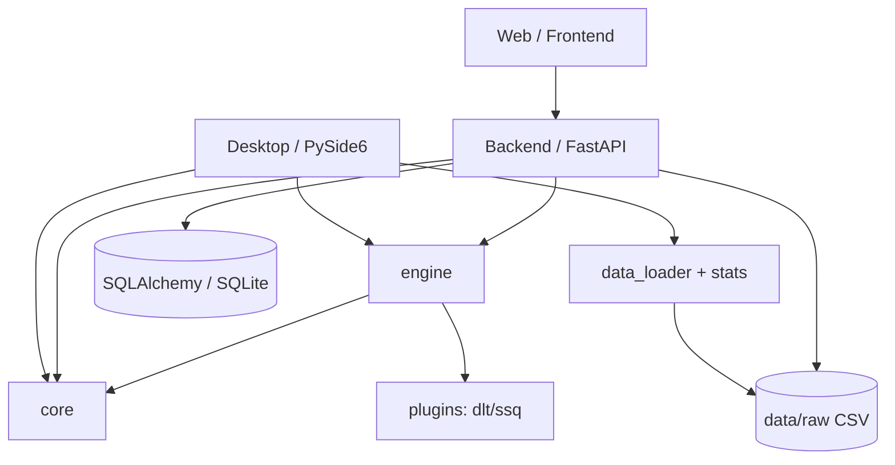

# Atlas Quant Platform — Sprint E1 Architecture Audit

> Engineering Sprint E1 · Phase 0 交付物
> 扫描时间：2026-08-02 · 扫描范围：全项目

---

## 1. 项目规模总览

| 指标 | 数值 |
|------|------|
| 顶层目录 | 24 个 |
| Python 源文件 | **462** |
| Python 包（含 `__init__.py`） | **219** |
| 总 Python 代码行数 | **83,749** |
| 测试文件 | 131 |
| 测试用例（pytest 收集口径） | **21,977** |
| Git 提交 | 5（main 分支，origin 已配置） |

### 各模块 Python 文件分布

| 目录 | 文件数 | 职责 |
|------|-------|------|
| `engine/` | 209 | 量化研究引擎（最大模块） |
| `tests/` | 139 | 测试套件 |
| `backend/` | 37 | FastAPI 后端服务 |
| `apps/` | 18 | 应用层 |
| `desktop/` | 14 | PySide6 桌面端 |
| `core/` | 13 | 领域核心类型 |
| `tools/` | 12 | 工程工具 |
| `plugins/` | 8 | 彩种插件（dlt/ssq） |
| `config/` | 2 | 配置 |
| `deployment/` | 2 | 部署 |
| `sdk/` | 1 | SDK 入口 |

---

## 2. 当前目录树（顶层）

```
AtlasQuant/
├── apps/            # 应用层（web 等）
├── backend/         # FastAPI 后端（api/v1, database, service）
├── branding/        # 品牌资源
├── config/          # 配置
├── core/            # 领域核心类型（types/models）
├── data/            # 数据（raw/processed/exports/cache）
├── data_market/     # 数据市场
├── deployment/      # 部署
├── desktop/         # PySide6 桌面端（windows/pages/charts）
├── dist/            # 构建产物
├── docker/          # Docker 编排
├── docs/            # 文档
├── engine/          # 量化研究引擎（209 文件）
├── first_run/       # 首次运行
├── frontend/        # Web 前端（Node）
├── help_center/     # 帮助中心
├── installer/       # Inno Setup 安装程序
├── launcher/        # 启动器
├── notebooks/       # 研究笔记本
├── plugins/         # 彩种插件
├── scripts/         # 工程脚本（build/clean/package/publish）
├── sdk/             # SDK
├── tests/           # 测试
├── tools/           # 工具（atlas-cli/config_wizard/...）
├── updater/         # 更新器
├── .github/         # GitHub（ISSUE_TEMPLATE/workflows）
├── .vscode/         # VSCode 工程
├── requirements*.txt / pyproject.toml / Makefile
```

---

## 3. 依赖关系（Dependency Graph）

### 3.1 顶层依赖强度（按 import 引用次数抽样）

```
engine      ████████████████████████████  112  ← 被引用最密集（核心）
core        ██████                          24
backend     ████                            17
sqlalchemy  ███                             14
PySide6     ██                               9   ← Desktop
fastapi     ██                               8   ← Backend
matplotlib  █                               7   ← Desktop charts
```

### 3.2 分层依赖模型



### 3.3 运行时依赖（requirements 家族）

| 文件 | 依赖 | 状态 |
|------|------|------|
| `requirements.txt` | fastapi / pydantic / sqlalchemy / pandas / numpy | ✅ 已定义 |
| `requirements-desktop.txt` | + PySide6 / matplotlib | ✅ 已定义 |
| `requirements-dev.txt` | + pytest / ruff | ✅ 已定义 |
| `requirements-web.txt` | + uvicorn | ✅ 已定义 |
| `requirements-ai.txt` | — | ❌ **缺失** |
| `requirements-enterprise.txt` | — | ❌ **缺失** |
| `constraints.txt` | — | ⚠️ 空文件 |

---

## 4. Risk Report（风险评估）

| 风险 | 等级 | 说明 |
|------|------|------|
| 单一 core 依赖集中（engine 112 处引用） | 中 | engine 改动影响面大，需依赖倒置 |
| Desktop 依赖 matplotlib 未锁版本 | 中 | `>=3.8.0` 无上限，可能意外升级破坏 API |
| `constraints.txt` 为空，依赖无锁定 | 高 | 无法复现构建，版本漂移风险 |
| 缺 `requirements-ai/enterprise` 分离 | 中 | 依赖边界不清晰 |
| desktop 页面功能依赖内置 CSV | 低 | 数据源单一，需预留多来源 |
| `.github/workflows` 是否存在完整 CI | 待确认 | 需审计 Actions 覆盖度 |
| VSCode 仅 settings.json，缺 launch/tasks/extensions | 中 | 无法一键 F5 调试 |

---

## 5. Technical Debt Report（技术债）

| 项目 | 说明 |
|------|------|
| 版本号不一致 | pyproject 为 0.1.0，桌面 UI 标 v0.7.0，README 标 v3.5.2，需统一版本策略 |
| 重复打包脚本 | scripts/ 与 tools/ 存在多个构建脚本（build.bat/sh、build_desktop.py、deploy_d_drive.py），需收敛 |
| spec 分散 | Atlas.spec 仅在 D 盘部署副本，源项目无 spec，需纳入工程 |
| 依赖声明分散 | requirements*.txt 与 pyproject.toml 双轨管理，需统一 |
| 缺少 LICENSE / CONTRIBUTING / SECURITY | 开源治理文件缺失 |
| 文档未体系化 | docs/ 需按 Developer/User/API 等分类补齐 |

---

## 6. Project Engineering Assessment（工程评估）

### 现状评级

| 维度 | 评分 | 备注 |
|------|------|------|
| 业务功能完整度 | ★★★★★ | 35 Sprint 积累，功能丰富 |
| Git 工程化 | ★★☆ | 已初始化，缺分支策略/规范/治理文件 |
| 可构建性 | ★★★ | 有脚本但分散，未统一 Build Pipeline |
| 可打包性 | ★★★☆ | 桌面可打包，缺 CLI/Worker 与 Installer 正式化 |
| 可安装性 | ★★☆ | setup.iss 存在但未验证完整安装流程 |
| 可部署性 | ★★★ | docker 配置存在，未验证 compose up |
| 可发布性 | ★★☆ | 缺 release/ 流程、Portable/Setup/Debug 产物 |
| 可维护性 | ★★★ | 代码质量良好，但版本/依赖/文档需治理 |

### 结论

Atlas 目前是「功能完备的开发文件夹」，距「企业级软件工程项目」的差距集中在：
**版本治理 → 依赖锁定 → 统一构建 → 正式打包 → 安装发布 → 文档体系 → CI/CD 自动化**。

Sprint E1 的目标即补足上述工程链，输出可运行、可安装、可发布的 Release Candidate。
