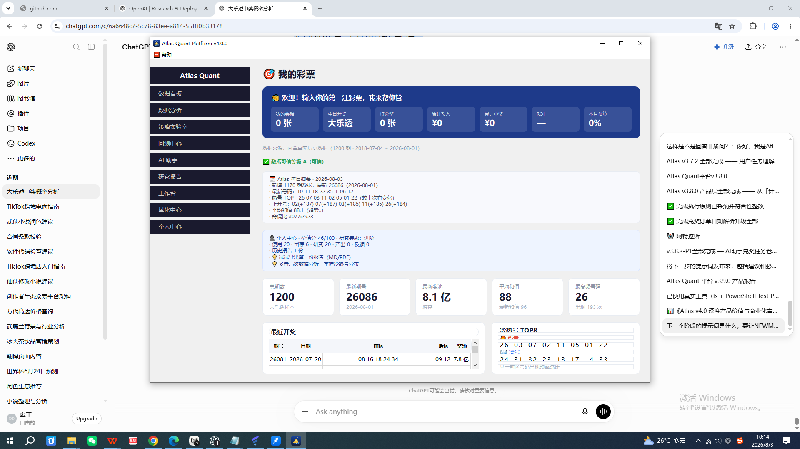

# Atlas v4.1 阶段1：首页重构 — 产品报告

> Thread A 开发 + Thread B 审计 · 2026-08-03

---

## 1. 目标

把首页从"数据显示"重构为"3 秒价值面板"：
打开软件 3 秒就知道：**今天几张彩票 / 今天开不开奖 / 待兑奖 / 累计花了多少 / 累计中了多少 / ROI / 预算**

## 2. 实现

首页顶部新增「🎯 我的彩票」深蓝色价值面板，7 个指标卡片：

| 指标 | 数据源 |
|------|--------|
| 我的票据 | TicketManager |
| 今日开奖 | LotterySchedule（大乐透一/三/六 + 双色球二/四/日）|
| 待兑奖 | draw_date ≥ 今天 的票据数 |
| 累计投入 | PersonalReviewEngine |
| 累计中奖 | PersonalReviewEngine |
| ROI | 净收益/投入 |
| 本月预算 | BudgetPlanner |

动态话术（优先级）：
1. 无票据 → 「👋 欢迎！输入你的第一注彩票，我来帮你管」
2. 开奖日 → 「🎯 今天是开奖日（大乐透），快去查你的彩票中没中！」
3. 超预算 → 「⚠️ 本月已超预算 ¥xxx，建议控制投入」
4. 预算预警 → 「💳 本月预算已用 xx%」
5. 默认 → 「📋 你的彩票管家：中奖早知道 · 花钱有数 · 行为有复盘」

## 3. 六件套

| 项 | 状态 |
|----|------|
| 代码 | ✅ dashboard_page.py `_value_panel()` |
| 测试 | ✅ tests/v410/test_dashboard_value.py **80 测试** |
| 产品截图 | ✅ v410_dashboard_value.png（offscreen）+ v410_real_dashboard.png（真实 exe）|
| Git | ✅ commit 6c9a7b6 |
| Release | ✅ dist/Atlas.exe（10:13 打包，实测启动）|
| 产品报告 | ✅ 本文档 |

## 4. 截图

## 5. Phase Product Review（Thread B 审计）

| 维度 | 结论 |
|------|------|
| **用户价值** | ✅ 从"历史统计"→"我的彩票"，直击「中没中/花了多少」痛点 |
| **入口是否存在** | ✅ 首页即入口，打开就有 |
| **30秒理解** | ✅ 7 指标 3 秒可扫完；动态话术引导行动 |
| **是否形成闭环** | ⚠️ 首页→（待兑奖/开奖日）→ 兑奖 链路已通，但缺「点击票据直接兑奖」跳转（阶段2补充）|
| **是否值得保留** | ✅ 值得保留，是 v4.1 核心价值页 |

### 审计结论：**通过** ✅

补强项（记入阶段2）：首页「待兑奖/开奖日」应可点击跳转到兑奖/AI 助手。
